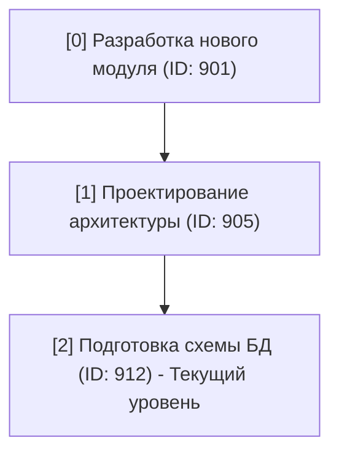

### Описание иерархических полей задач

Поля `id_zadach_ierarhiya` и `title_zadach_ierarhiya` используются для хранения информации о вложенности задач в Битрикс24.

1. **Тип данных**: Оба поля являются массивами (или списками), где порядок элементов имеет решающее значение.

2. **Структура**: Они представляют собой "путь" или "цепочку" от самой верхней, родительской задачи до самой нижней (текущей) задачи, в которой была сделана временная отметка.

3. **Содержимое**:

   -  `id_zadach_ierarhiya`: содержит массив **ID** задач.

   -  `title_zadach_ierarhiya`: содержит массив **названий (title)** этих же задач.

4. **Соответствие**: Элементы в обоих массивах синхронизированы. `id_zadach_ierarhiya[0]` -- это ID для задачи с названием `title_zadach_ierarhiya[0]`.

#### Схема-пример

Представим, что у вас есть такая структура задач в Битрикс24:

-  "Разработка нового модуля" (ID: 901)

   -  "Проектирование архитектуры" (ID: 905)

      -  "Подготовка схемы БД" (ID: 912)  \<- *В этой задаче поставили метку времени.*

В этом случае, для элемента смарт-процесса, связанного с этой меткой времени, поля будут выглядеть так:

-  `id_zadach_ierarhiya` = `["901", "905", "912"]`

-  `title_zadach_ierarhiya` = `["Разработка нового модуля", "Проектирование архитектуры", "Подготовка схемы БД"]`

**Визуальная схема иерархии (Mermaid):**

### Дополнение: Ключевые поля Проекта

Были добавлены два новых поля для прямой идентификации проекта, связанного с меткой времени.

-  **ID проекта**: `UF_CRM_87_1764265626`

-  **Название проекта**: `UF_CRM_87_1764265641`

**Важное замечание:** Наличие поля "Название проекта" (`UF_CRM_87_1764265641`) является **предпочтительным** способом определения проекта для метки времени. Логика, использующая название самой верхней задачи в иерархии (`title_zadach_ierarhiya[0]`), должна считаться **запасным вариантом** на случай, если это новое поле по какой-то причине не заполнено.

### Отчет №1: Метки времени по сотрудникам и проектам

**Основная цель:** Показать, сколько времени сотрудники тратят на задачи в разрезе проектов и с полной иерархией подзадач.

#### 1\. Структура данных (Строки отчета)

Отчет будет иметь вложенную (древовидную) структуру строк, сгруппированных в следующем порядке:

-  **Уровень 1 (Верхний): Сотрудник**

   -  Это ФИО пользователя, который указан в поле `sotrudnik` (ответственный) в метке времени.

-  **Уровень 2: Проект**

   -  Название проекта, к которому относится задача. Определяется по полю `UF_CRM_87_1764265641` или, в качестве запасного варианта, из `title_zadach_ierarhiya[0]`.

-  **Уровень 3: Иерархия задач**

   -  Полная цепочка задач от родительской до той, в которой была оставлена метка.

-  **Уровень 4: Метки времени**

   -  Каждая метка выводится отдельной строкой внутри своей задачи.

#### 2\. Отображаемая информация (Столбцы отчета)

| Столбец                             | Описание                                             |
|-------------------------------------|------------------------------------------------------|
| **Название задачи / Метка времени** | Имя сущности (задача или метка)                      |
| **ID задачи**                       | ID задачи, к которой привязана метка                 |
| **Количество часов**                | Значение из поля `kolichestvo_chasov`                |
| **Тип часов**                       | Текстовое значение "Учитываемые" или "Неучитываемые" |
| **Дата отражения**                  | Дата создания метки времени                          |

#### 3\. Фильтрация отчета

1. **Фильтр по сотруднику**

2. **Фильтр по проекту/группе**

3. **Фильтр по дате**

**Действие:** Отчет генерируется по клику на кнопку "Сформировать".

---

### Отчет №2: Отчет по проектам

**Основная цель:** Показать затраты времени в разрезе проектов, с детализацией по сотрудникам и задачам.

#### 1\. Структура данных (Строки отчета)

Иерархия группировки:

-  **Уровень 1 (Верхний): Проект**

-  **Уровень 2: Сотрудник**

-  **Уровень 3: Иерархия задач**

-  **Уровень 4: Метки времени**

**Важное уточнение по группировке:** Если несколько сотрудников работают над одним проектом и/или одной и той же задачей, то отчет будет разделять их вклад.

#### 2\. Отображаемая информация (Столбцы) и Фильтры

Столбцы и фильтры **идентичны** первому отчету.

---

### Отчет №3: Ежемесячный табель по сотрудникам

**Основная цель:** Показать сводную информацию о часах работы каждого сотрудника за выбранный месяц в виде календаря, с возможностью детализации по дням.

#### 1\. Структура отчета (Таблица-матрица)

-  **Строки** -- это **Сотрудники**.

-  **Столбцы** -- это **Сводка за месяц** и **Дни календарного месяца**.

#### 2\. Описание столбцов

1. **Сводные столбцы:** `Сотрудник`, `Учтено`, `Не учтено`, `Всего`.

2. **Столбцы-дни:** Динамический ряд столбцов для каждого дня месяца с выделением выходных.

#### 3\. Данные в ячейках и интерактивность

-  В ячейках -- **сумма часов** за день.

-  **Клик по ячейке** открывает **popup** с детализацией меток времени.

#### 4\. Фильтрация

-  Основной фильтр -- **выбор месяца и года**.

---

### Отчет №4: Заглушка

**Статус:** В разработке.